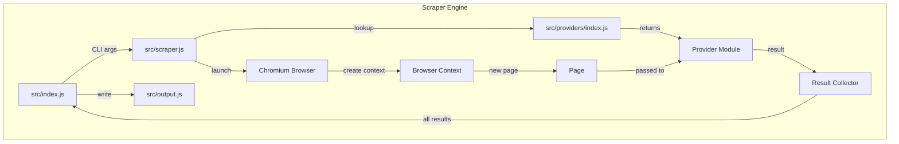
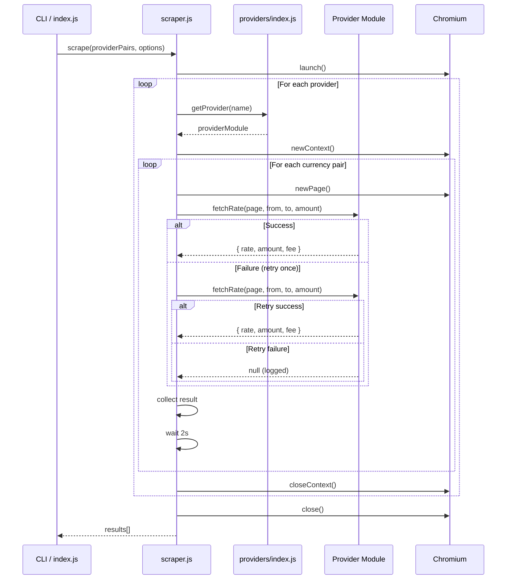

# Scraper Engine

## Overview

The scraper engine manages the Playwright browser lifecycle, dispatches scraping work to provider modules, handles retries and errors, and collects results. It is the central orchestrator that connects CSV input to provider scrapers to output.

## Requirements

1. **Browser Lifecycle** (`src/scraper.js`)
   - Launch Chromium using `BROWSER_OPTIONS` from config
   - Create one browser context per provider using `CONTEXT_OPTIONS`
   - Close context after each provider completes
   - Close browser after all providers complete
   - Handle graceful shutdown on SIGINT/SIGTERM

2. **Provider Registry** (`src/providers/index.js`)
   - Map provider names (from CSV) to provider modules
   - `getProvider(name)` returns the module or null for unknown providers
   - Log warning for unrecognized provider names

3. **Orchestration**
   - Process providers sequentially (one at a time)
   - Process currency pairs within a provider sequentially
   - Wait `TIMEOUTS.betweenRequests` (2s) between pairs to avoid rate limiting
   - Log progress: `[ProviderName] 3/49 USD→NGN: rate=1580.50`

4. **Error Handling & Retries**
   - Wrap each `fetchRate()` call in try/catch
   - On failure: retry once after 5s delay
   - On second failure: log error, record null result, continue to next pair
   - Never let one provider's failure stop other providers
   - Capture screenshot on failure to `output/errors/` for debugging

5. **Result Collection**
   - Each result includes: provider, sendCurrency, receiveCurrency, sendAmount, exchangeRate, receiveAmount, fee, timestamp
   - Accumulate all results in memory
   - Return full results array to caller

6. **Entry Point** (`src/index.js`)
   - Parse CLI args (optional: `--provider=Wise`, `--pair=USD/NGN`, `--headful`)
   - Load Provider.csv
   - Filter to specific provider/pair if CLI args given
   - Run scraper engine
   - Write output via output.js
   - Print summary stats (total pairs, successful, failed)

7. **Test Runner** (`src/test-provider.js`)
   - Quick test of a single provider with a single currency pair
   - Usage: `node src/test-provider.js Wise USD NGN`
   - Launches browser, runs one fetchRate, prints result, exits
   - Useful for developing/debugging individual providers

## Architecture



### Data Flow



### Interface Definitions

```javascript
// Provider module contract
module.exports = {
  name: 'ProviderName',
  async fetchRate(page, sendCurrency, receiveCurrency, sendAmount) {
    return {
      exchangeRate: Number | null,
      receiveAmount: Number | null,
      fee: Number | null,
    };
  },
};

// Scraper engine
async function scrape(providerPairs, options) {
  // providerPairs: { [name]: { name, url, pairs: [{ sendCurrency, receiveCurrency }] } }
  // options: { headless, providerFilter, pairFilter }
  // returns: Result[]
}

// Result shape
{
  provider: String,
  sendCurrency: String,
  receiveCurrency: String,
  sendAmount: Number,
  exchangeRate: Number | null,
  receiveAmount: Number | null,
  fee: Number | null,
  timestamp: String, // ISO 8601
  success: Boolean,
  error: String | null,
}
```

### Error Handling Strategy

- Each `fetchRate` is wrapped in try/catch with retry
- Screenshot saved to `output/errors/{provider}_{from}_{to}_{timestamp}.png`
- Error message stored in result object
- Provider-level errors don't propagate to other providers
- Browser crash → re-launch and continue

### Performance Considerations

- Sequential per-provider to avoid IP-based rate limiting
- 2s delay between requests within a provider
- Single browser instance, one context per provider (avoids memory bloat)
- Page closed after each pair (prevents memory leaks)

## Tasks

- [ ] Task 1: Implement `src/providers/index.js` — provider registry with `getProvider()`
- [ ] Task 2: Implement `src/scraper.js` — browser launch/close lifecycle
- [ ] Task 3: Add context creation and page management to scraper.js
- [ ] Task 4: Add sequential provider + pair orchestration loop
- [ ] Task 5: Add error handling with single retry and 5s delay
- [ ] Task 6: Add screenshot capture on failure to `output/errors/`
- [ ] Task 7: Add progress logging (`[Provider] N/M FROM→TO: rate=X`)
- [ ] Task 8: Implement `src/index.js` — CLI args, CSV loading, scraper invocation, output
- [ ] Task 9: Implement `src/test-provider.js` — single-provider test runner
- [ ] Task 10: Add graceful shutdown handler (SIGINT/SIGTERM)

## Testing

### Test Cases

1. **Provider registry — known provider**
   - Given: Registry loaded
   - When: `getProvider('Wise')` called
   - Then: Returns Wise module with `fetchRate` function

2. **Provider registry — unknown provider**
   - Given: Registry loaded
   - When: `getProvider('Unknown')` called
   - Then: Returns null

3. **Scraper — empty pairs**
   - Given: No pairs to scrape
   - When: `scrape({})` called
   - Then: Returns empty array, no browser launched

4. **Retry logic — succeeds on retry**
   - Given: Provider that fails once then succeeds
   - When: Pair is scraped
   - Then: Result contains rate data (not null)

5. **Retry logic — fails after retry**
   - Given: Provider that always fails
   - When: Pair is scraped
   - Then: Result has `success: false` and error message

## Success Criteria

- [ ] All tasks completed
- [ ] All tests passing
- [ ] Engine processes multiple providers sequentially
- [ ] Errors are isolated per provider
- [ ] Progress is logged clearly
- [ ] Screenshots captured on failure

---

_Created: 2026-04-25_
