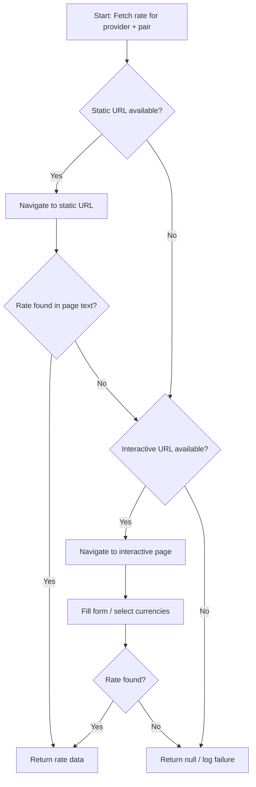
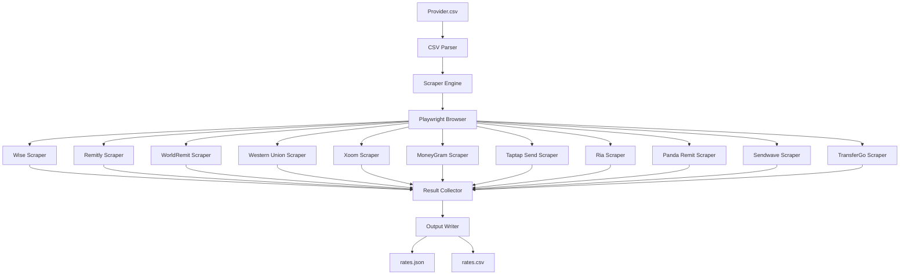
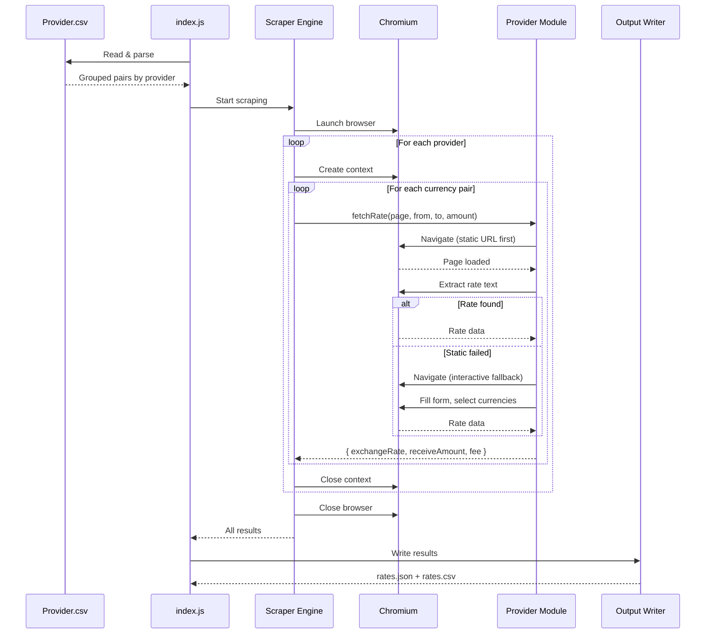

# Overview

Build a Node.js web scraper that fetches exchange rates from 11 remittance providers using Playwright with headless Chromium. The scraper reads currency pair definitions from `Provider.csv` and navigates to each provider's currency converter page to extract exchange rates, receive amounts, and fees.

## Goals

- Parse `Provider.csv` to extract provider/currency pair combinations (423 rows, 11 providers)
- For each provider, implement a Playwright-based scraper that navigates to the currency converter page
- Extract exchange rate, receive amount, and fee data for each currency pair
- Use a **static-first, interactive-fallback** scraping strategy for reliability and speed
- Output structured results (JSON/CSV) with timestamps
- Handle anti-bot measures, cookie consent, and dynamic rendering gracefully

## Implementation Location

- Primary implementation: `src/`
- Provider scrapers: `src/providers/`
- Tests: `tests/`
- Configuration: `src/config.js`
- Entry point: `src/index.js`

## Known Issues

None currently identified.

## Language Stack

### Languages Used

| Language | Purpose | Skill Location |
|----------|---------|----------------|
| JavaScript (Node.js) | All implementation — scraping, orchestration, tests | `.agents/skills/javascript-clean-code/skill.md` |

### Mandatory Pre-Implementation Steps

1. **Identify languages** from this section
2. **Read language skills** — locate `.agents/skills/javascript-clean-code/skill.md`
3. **Follow standards strictly** — zero tolerance for deviations

### JavaScript Requirements

- CommonJS modules (`require`/`module.exports`)
- Node.js 18+ (v25.3.0 available on this system)
- No TypeScript — plain JavaScript
- No unnecessary comments
- `npm test` must pass before any commit

---

## Scraping Strategy (CRITICAL)

All provider scrapers MUST follow this priority order:

### Priority 1: Static Page

Navigate to a URL that embeds the currency pair in the path or query params. Read the rate directly from the page text without form interaction.

**Advantages:** Faster, fewer failure points, less bot detection risk, no form interaction needed.

**Example:** `https://wise.com/gb/currency-converter/usd-to-ngn-rate?amount=1000`

### Priority 2: Interactive Fallback

Load the provider's calculator page, fill in amount inputs, select currencies via dropdowns, wait for rate to calculate, then extract the result.

**Advantages:** Works when no static page exists, can access more detailed pricing data.

**Example:** `https://wise.com/gb/send-money/` → select currencies → fill amount → read result

### Decision Flow



---

## Provider Summary

| Provider | Site | Send Currencies | Receive Currencies | Total Pairs |
|----------|------|-----------------|-------------------|-------------|
| Wise | wise.com | AED,AUD,CAD,EUR,GBP,PLN,USD | GHS,INR,KES,MXN,NGN,PHP,PKR | 49 |
| Remitly | remitly.com | AED,AUD,CAD,EUR,GBP,PLN,USD | GHS,INR,KES,MXN,NGN,PHP,PKR | 49 |
| WorldRemit | worldremit.com | AUD,CAD,EUR,GBP,PLN,USD | GHS,INR,KES,MXN,NGN,PHP,PKR | 42 |
| Western Union | westernunion.com | AED,AUD,CAD,EUR,GBP,PLN,USD | GHS,INR,KES,MXN,NGN,PHP,PKR | 49 |
| Xoom | xoom.com | AUD,CAD,EUR,GBP,USD | GHS,INR,KES,MXN,NGN,PHP,PKR | 35 |
| MoneyGram | moneygram.com | AED,AUD,CAD,EUR,GBP,PLN,USD | GHS,INR,KES,MXN,NGN,PHP,PKR | 49 |
| Taptap Send | taptapsend.com | AED,AUD,CAD,EUR,GBP,PLN,USD | GHS,INR,KES,MXN,NGN,PHP,PKR | 49 |
| Ria | riamoneytransfer.com | AUD,CAD,EUR,GBP,PLN,USD | GHS,INR,KES,MXN,NGN,PHP,PKR | 42 |
| Panda Remit | pandaremit.com | AUD,CAD,EUR,GBP,USD | GHS,INR,MXN,PHP,PKR | 25 |
| Sendwave | sendwave.com | CAD,EUR,GBP,USD | GHS,INR,KES,MXN,NGN,PHP,PKR | 28 |
| TransferGo | transfergo.com | EUR,GBP,PLN | INR,NGN | 5 |

### Currency-to-Country Mapping

Required by providers that use country codes in URLs:

| Currency | Country Code | Country Name | Slug |
|----------|-------------|--------------|------|
| AED | AE | United Arab Emirates | united-arab-emirates |
| AUD | AU | Australia | australia |
| CAD | CA | Canada | canada |
| EUR | DE | Germany | germany |
| GBP | GB | United Kingdom | united-kingdom |
| PLN | PL | Poland | poland |
| USD | US | United States | united-states |
| GHS | GH | Ghana | ghana |
| INR | IN | India | india |
| KES | KE | Kenya | kenya |
| MXN | MX | Mexico | mexico |
| NGN | NG | Nigeria | nigeria |
| PHP | PH | Philippines | philippines |
| PKR | PK | Pakistan | pakistan |

---

## Feature Index

The implementation is divided into features with clear dependencies. Each feature contains detailed requirements, tasks, and verification steps in its respective `feature.md` file.

**Implementation Guidelines:**
- Implement features in dependency order
- Each feature contains complete requirements and tasks
- Refer to individual feature.md files for detailed specifications

| #  | Feature | Description | Dependencies | Status |
|----|---------|-------------|--------------|--------|
| 0  | [core-infrastructure](./features/00-core-infrastructure/feature.md) | Project setup, config, CSV parser, output formatting, currency mapping | None | ✅ Complete |
| 1  | [scraper-engine](./features/01-scraper-engine/feature.md) | Browser lifecycle, provider interface, orchestration, retry logic, result collection | 0 | ✅ Complete |
| 2  | [wise](./features/02-wise/feature.md) | Wise provider scraper (static converter + interactive send-money fallback) | 1 | ✅ Complete |
| 3  | [remitly](./features/03-remitly/feature.md) | Remitly provider scraper (country URL + converter fallback) | 1 | ✅ Complete |
| 4  | [worldremit](./features/04-worldremit/feature.md) | WorldRemit provider scraper (currency-converter page) | 1 | ✅ Complete |
| 5  | [western-union](./features/05-western-union/feature.md) | Western Union provider scraper (currency-converter.html) | 1 | ✅ Complete |
| 6  | [xoom](./features/06-xoom/feature.md) | Xoom provider scraper (send-money/transfer with countryCode) | 1 | ✅ Complete |
| 7  | [moneygram](./features/07-moneygram/feature.md) | MoneyGram provider scraper (403-protected, Playwright required) | 1 | ✅ Complete |
| 8  | [taptap-send](./features/08-taptap-send/feature.md) | Taptap Send provider scraper (homepage calculator) | 1 | ✅ Complete |
| 9  | [ria](./features/09-ria/feature.md) | Ria provider scraper (dynamically loaded calculator) | 1 | ✅ Complete |
| 10 | [panda-remit](./features/10-panda-remit/feature.md) | Panda Remit provider scraper (URL-parameterized converter) | 1 | ✅ Complete |
| 11 | [sendwave](./features/11-sendwave/feature.md) | Sendwave provider scraper (homepage calculator) | 1 | ✅ Complete |
| 12 | [transfergo](./features/12-transfergo/feature.md) | TransferGo provider scraper (homepage/converter calculator) | 1 | ✅ Complete |
| 13 | [testing](./features/13-testing/feature.md) | Test infrastructure — unit, integration, and provider smoke tests | 0, 1 | ✅ Complete |

Status Key: ⬜ Pending | 🔄 In Progress | ✅ Complete

## Requirements Conversation Summary

This specification was created through collaborative requirements gathering:
- User provided Provider.csv with 423 provider/currency pair rows across 11 remittance providers
- User specified Node.js + Playwright (headless Chromium) as the stack
- User provided specific URL patterns for Western Union (`/sg/en/currency-converter.html`) and Xoom (`?countryCode=XX`)
- User specified Remitly country-based URL pattern (`/{fromCountry}/en/{toCountry}`)
- User specified Wise has both static converter and interactive send-money pages
- User mandated **static-first, interactive-fallback** scraping strategy for all providers
- All project files live in the root directory (no nested project folder)

## High-Level Architecture



### Architecture Layers

1. **Input Layer** — CSV parser reads Provider.csv, groups rows by provider
2. **Engine Layer** — Manages browser lifecycle, dispatches to provider scrapers, handles retries
3. **Provider Layer** — One module per provider implementing the scraping contract
4. **Output Layer** — Collects results, writes to JSON/CSV with timestamps

### Provider Interface Contract

Every provider module exports:
```javascript
module.exports = {
  name: 'ProviderName',
  async fetchRate(page, sendCurrency, receiveCurrency, sendAmount) {
    return {
      exchangeRate: Number | null,
      receiveAmount: Number | null,
      fee: Number | null,
    };
  },
};
```

### Data Flow



### Technical Decisions and Trade-offs

| Decision | Rationale | Alternatives Considered |
|----------|-----------|------------------------|
| Playwright over Puppeteer | Better API, built-in auto-waiting, cross-browser support | Puppeteer (less robust selectors) |
| CommonJS over ESM | Simpler, avoids Playwright ESM edge cases | ESM (import/export) |
| Static-first scraping | Faster, less detectable, fewer failure points | Interactive-only (more fragile) |
| Sequential per provider | Respects rate limits, avoids IP bans | Full parallel (risk of blocking) |
| Regex rate extraction | Works across DOM structures, resilient to layout changes | CSS selectors (fragile to redesigns) |
| One module per provider | Isolated failures, independent testing, clear ownership | Single monolith scraper |

## Success Criteria (Spec-Wide)

### Functionality
- All 14 features completed and verified
- Scraper successfully fetches rates from all 11 providers
- Output contains exchange rate, receive amount, and fee for each supported pair
- Handles unsupported currency pairs gracefully (returns null, logs warning)
- Handles provider downtime/errors without crashing

### Code Quality
- `npm test` passes with all tests green
- No unhandled promise rejections
- Clean console output with progress logging
- Provider failures are isolated (one provider failing doesn't stop others)

### Documentation
- `LEARNINGS.md` captures scraping discoveries per provider
- `VERIFICATION.md` produced with all checks passing
- `REPORT.md` created documenting final implementation

---

_Created: 2026-04-25_
_Last Updated: 2026-04-25_
_Structure: Feature-based (has_features: true)_
